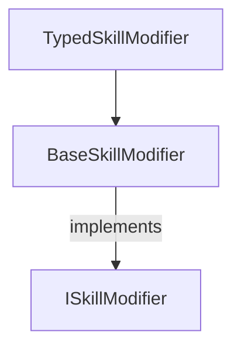

# Supporting Skills++ for modded characters

Skills++ is built upon Risk of Rain 2's entity state system that describes the behaviour of a skill.
The core concept for Skills++ is are the `SkillModifier` classes that are associated to skills.
When it comes to implementing your character you will only need to work with the skills since the mod does not care about the character loaded.




## Creating the plugin

## Implementing a skill modifier

The simplest way to implement a skill modifier is to subclass `TypedSkillModifier`.
The `TypedSkillModifier` simplifies the implementation immensely by making some assumptions which are often true for simple skills.
There is a single generic type parameter for a `TypedSkillModifier`.
The type should represent the entity state used to perform the skill.
If your skill needs to support multiple different states then refer to [advanced skill modifier implementations](https://gitlab.com/cwmlolzlz/ror2skillsplusplus/-/tree/feature/public-api/Documentation/supporting-modded-characters.md#advanced-skill-modifier-implementations)

The other important requirement for a skill modifier is that the class is attributed with the `SkillModifier`.
The attribute needs to name the skills the modifier can be applied to.

Here is an example of modifying the Commando's primary attack to increase it's rate of fire every level.
```c#
[SkillLevelModifier("FirePistol")]
class CommandoFirePistolSkillModifier : TypedBaseSkillModifier<FirePistol2> {

    public override int MaxLevel {
        get { return 4; }
    }

    public override void OnSkillLeveledUp(int level, CharacterBody characterBody, SkillDef skillDef) {
        base.OnSkillLeveledUp(level, characterBody, skillDef);
        FirePistol2.baseDuration = MultScaling(0.2f, -0.20f, level);         
    }

}
```

Let's break this down line by line.

```
[SkillLevelModifier("FirePistol")]
```
This marks that the `CommandoFirePistolSkillModifier` is for the skill named `FirePistol`.
`FirePistol` is the internal name for Commando's double tap skill.

```
class CommandoFirePistolSkillModifier : TypedBaseSkillModifier<FirePistol2>
```


> More advanced implementations can be found later in this guide.

## Loading the skill modifier in game

## Common upgrades

### Granting buffs
### Adding stock
### Changing projectile
### Changing hitbox

## Advanced skill modifier implementations