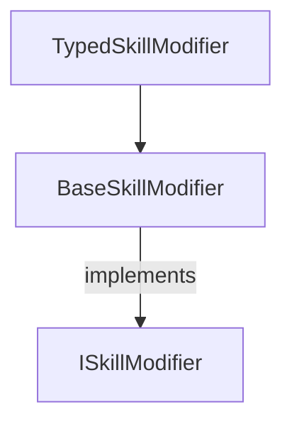

# Supporting Skills++ for modded characters

Mod version: 0.0.11

> Note: This guide is for alpha versions of the Skills++ mod.
> All code examples and described methods may change in future releases.
> **Breaking changes will occur as the mod evolves.**

Skills++ is built upon Risk of Rain 2's entity state system that describes the behaviour of a skill.
The core concept for Skills++ is are the `SkillModifier` classes that are associated to skills.
When it comes to implementing your character you will only need to work with the skills since the mod does not care about the character loaded.



## Before you begin

Skills++ deals directly with the internal entity states and logic of skills. 
It is highly recommended that you understand how Risk of Rain 2's skills are implemented using entity state machines.

## Creating the plugin

## Implementing a skill modifier

The simplest way to implement a skill modifier is to subclass `TypedSkillModifier`.
The `TypedSkillModifier` simplifies the implementation immensely by making some assumptions which are often true for simple skills.
There is a single generic type parameter for a `TypedSkillModifier`.
The type represents the entity state used when the skill is activated.

If your custom skill uses multiple entity states then refer to [advanced skill modifier implementations](https://gitlab.com/cwmlolzlz/ror2skillsplusplus/-/tree/feature/public-api/Documentation/supporting-modded-characters.md#advanced-skill-modifier-implementations)

The other important requirement for a skill modifier is that the class is attributed with the `BaseSkillModifier`.
The attribute needs to name the skills the modifier can be applied to.

There are three hooks that can be implemented.

* `OnSkillLeveledUp(int level, CharacterBody body, SkillDef skillDef)`</br>
  Called when the user invests a skill point in the modifiers associated skill. This happens immediately and is the ideal place for updating static variables on your `EntityStates`.

  Relevant `CharacterBody` and `SkillDef` references are provided in case the modifier's behaviour needs to make changes.

* `OnSkillEnter(BaseState state, int level)`</br>
  Fired when the skill is used and the character enters the associated entity states.

* `OnSkillExit(BaseState state, int level)`</br>

If you are implementing a `TypedSkillModifier<T>` then the type of the state provided to `OnSkillEnter` and `OnSkillExit` will match the generic type `T`.

Here is an example of modifying the Commando's primary attack to increase it's rate of fire every level.

```c#
[SkillLevelModifier("FirePistol")]
class CommandoFirePistolSkillModifier : TypedBaseSkillModifier<FirePistol2> {

    public override int MaxLevel {
        get { return 4; }
    }

    public override void OnSkillLeveledUp(int level, CharacterBody characterBody, SkillDef skillDef) {
        base.OnSkillLeveledUp(level, characterBody, skillDef);
        FirePistol2.baseDuration = MultScaling(0.2f, -0.20f, level); // decrease the pistols base duration by 20% every level
    }

}
```

Let's break this down line by line.

```c#
[SkillLevelModifier("FirePistol")]
```

This marks that the `CommandoFirePistolSkillModifier` is for the skill named `FirePistol`.
`FirePistol` is the internal name for Commando's double tap skill.

```c#
class CommandoFirePistolSkillModifier : TypedBaseSkillModifier<FirePistol2> {
```

Here the name of this new class is not important.
`FirePistol2` is the game's internal class for handling the firing of the Commando's primary skill.
It is used to specify the entity state this skill modifer concerns.

```c#
    public override int MaxLevel {
        get { return 4; }
    }
```

Despite the maximum level for this skill being four this skill can be levelled up three times.
Within Skills++ a skill with no upgrades is considered to be at level one.

```c#
    public override void OnSkillLeveledUp(int level, CharacterBody characterBody, SkillDef skillDef) {
        base.OnSkillLeveledUp(level, characterBody, skillDef);
        FirePistol2.baseDuration = MultScaling(0.2f, -0.20f, level); // decrease the pistols base duration by 20% every level
    }
```

This defines the changes to the skill when the user spends a point on the skill.
The base duration for the firing of the pistol is reduced by 20% per level. This is equivalent to a 20% increase in rate of fire.

> `MultScaling` is a special utility function that makes it easier to express the scaling of a parameter.</br>
> Refer to the [scaling operators guide](scaling-operators.md) for details

## Loading the skill modifier in game

There are two steps to ensuring the your skill modifiers are loaded into the game.

The first step it to make sure your project lists Skills++ as a BepInEx depenendancy.
This can be done by adding `[BepInDependency("com.cwmlolzlz.skills")]` to your main plugin class.

The final step is to ensure the Skills++ has found all the skill modifiers in your mod.
Luckily, there is a single method to call when you mod launches that will automatically locate all skill modifier classes in your code.

```c#
    SkillModifierManager.LoadSkillModifiers();
```

Altogether you should have the following code.

```c#
namespace MyCommandoSkillModifierMod {

    [BepInDependency("com.bepis.r2api")]
    [BepInDependency("com.cwmlolzlz.skills")]
    [BepInPlugin("com.example.com", "MyCommandoSkillModifier", "1.0.0")]
    public class MyCommandoSkillModifierPlugin : BaseUnityPlugin {

        public void Awake() {
            SkillModifierManager.LoadSkillModifiers();
        }

    }

    [SkillLevelModifier("FirePistol")]
    class CommandoFirePistolSkillModifier : TypedBaseSkillModifier<FirePistol2> {

        public override int MaxLevel {
            get { return 4; }
        }

        public override void OnSkillLeveledUp(int level, CharacterBody characterBody, SkillDef skillDef) {
            base.OnSkillLeveledUp(level, characterBody, skillDef);
            FirePistol2.baseDuration = MultScaling(0.2f, -0.20f, level); // decrease the pistols base duration by 20% every level
        }

    }
}
```

## Common upgrade patterns

### Granting buffs

Coming soon

### Adding stock

Coming soon

### Changing projectile behaviour

Coming soon

### Changing hitbox

Coming soon

## Advanced skill modifier implementations

Sometimes a single skill has complex behaviour that is spread amongst several 
